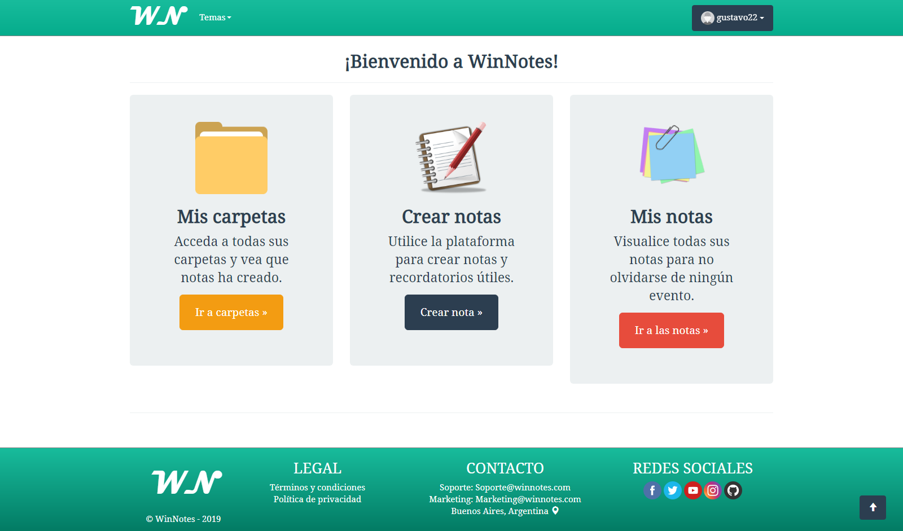
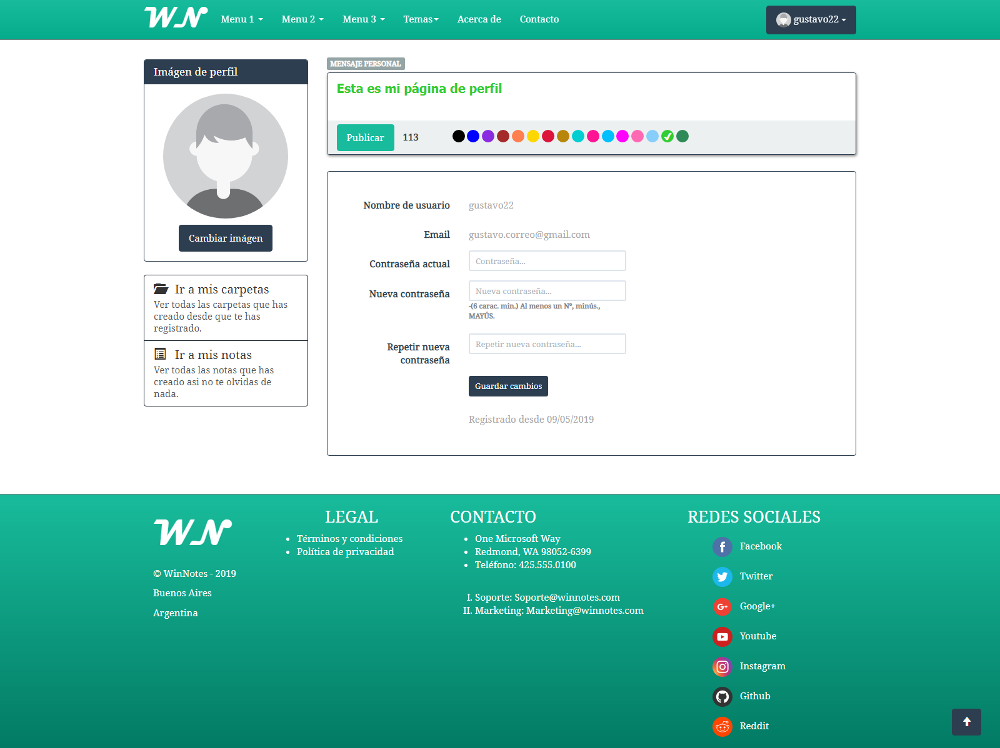
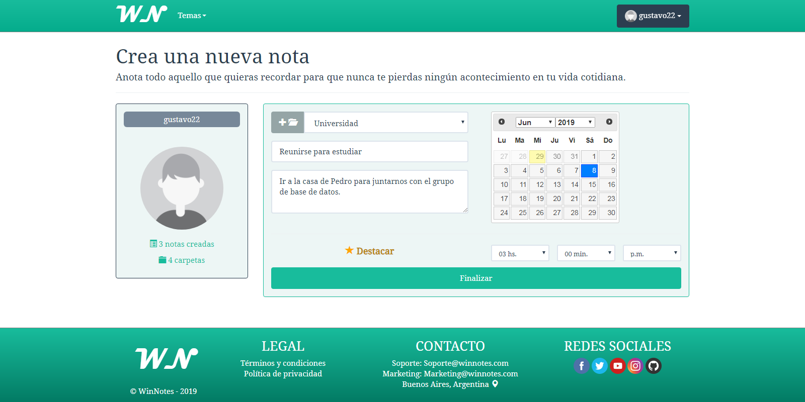
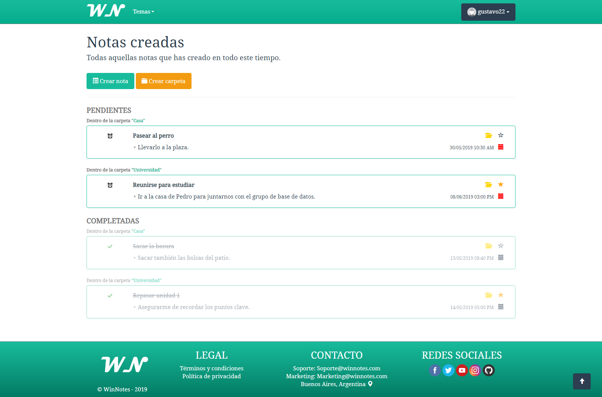

# WinNotes
Aplicación web para organizar todas tus tareas y no olvidarte de nada.

Inicio
:-------------------------:

Perfil
:-------------------------:

Vista de carpetas
:-------------------------:

Crear nota
:-------------------------:

Vista de notas
:-------------------------:

## Funcionalidades
<ul>
  <li>Crear usuarios</li>
  <li>Crear notas con descripciones y fecha de caducidad</li>
  <li>Posibilidad de establecer una alarma a la nota a una hora determinada</li>
  <li>Destacar las notas mediante una estrella</li>
  <li>Completar una nota manualmente</li>
  <li>Organizar las notas mediante carpetas</li>
  <li>Configurar el perfil (imágen de perfil, mensaje personal y cambio de contraseña)</li>
</ul>

## Tecnologías
<ul>
  <li>HTML5</li>
  <li>CSS</li>
  <li>Javascript</li>
  <li>Jquery</li>
  <li>Jquery UI</li>
  <li>Ajax</li>
  <li>Bootstrap</li>
  <li>ASP.NET MVC C#</li>
  <li>Entity Framework</li>
  <li>SQL Server</li>
</ul>

## Notas
El script de generación de la base de datos se encuentra en la carpeta "Sql_script" dentro del proyecto.

## Autor
Gustavo Vasquez
